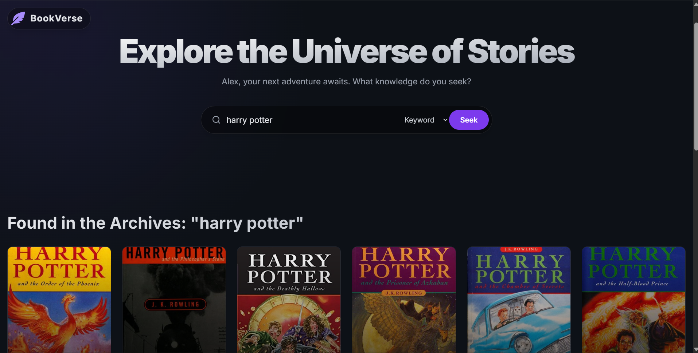

# 📖 BookVerse - A Modern Book Discovery App

  
  
  
  
  

**BookVerse** is a visually stunning, frontend-only web application for discovering books. Built for the modern web, it provides an immersive and dynamic interface to explore the vast collection of the Open Library API. This project was designed to be not just a functional tool, but a delightful experience for any book lover.

**[➡️ View Live Demo](https://aganith-task-naukri1025.netlify.app/)** 

---

## ✨ Features

*   **Immersive User Interface:** A beautiful, dark-mode-first design featuring an interactive, mouse-aware "aurora" gradient background.
*   **Versatile Search:** Users can search for books by general **Keyword**, specific **Title**, or **Author**.
*   **Dynamic Homepage:** The application greets users with a curated list of "Featured" or "Trending" books, providing immediate engagement.
*   **Advanced Loading States:** Instead of generic spinners, the UI uses sleek **skeleton placeholders** that mimic the final layout, providing a superior loading experience.
*   **Glassmorphism & Depth:** Key UI elements like the header and search bar use a frosted-glass effect (`backdrop-blur`) to create a sense of layering and depth.
*   **Fluid Animations:** Powered by **Framer Motion**, all animations are purposeful and smooth, from page load transitions to satisfying hover effects on book cards.
*   **Informative Book Cards:** Each card displays the book cover, title, author, and rating, with a beautiful hover effect to reveal more details.
*   **Pagination:** Efficiently navigate through thousands of search results.
*   **Fully Responsive:** A mobile-first design that looks and works perfectly on all devices, from small phones to large desktop monitors.
*   **Robust Error Handling:** Clear and user-friendly messages for network errors or when no search results are found.
*   **No Backend Needed:** The application runs entirely in the browser and communicates directly with the Open Library API, making it lightweight and easy to deploy.

## 🛠️ Tech Stack

This project leverages a modern, powerful frontend technology stack:

*   **Core:**
    *   **React:** A JavaScript library for building user interfaces.
    *   **Vite / Create React App:** For a fast and optimized development environment.
*   **Styling:**
    *   **Tailwind CSS:** A utility-first CSS framework for rapid and consistent styling.
*   **Animation:**
    *   **Framer Motion:** A production-ready animation library for creating fluid and complex animations.
*   **API & Data Fetching:**
    *   **Axios:** A promise-based HTTP client for making API requests.
*   **Icons:**
    *   **React Icons:** A library providing a huge collection of high-quality icons.

## 🚀 Getting Started

Follow these instructions to get a local copy of the project up and running for development and testing purposes.

### Prerequisites

*   Node.js (v16 or later recommended)
*   npm or yarn package manager

### Installation & Setup

1.  **Clone the repository:**
    ```bash
    git clone https://github.com/Balaji-bj45/Aganitha-BookVerse-Task.git
    cd bookverse
    ```

2.  **Install dependencies:**
    ```bash
    npm install
    # or if you use yarn
    # yarn install
    ```

3.  **Run the development server:**
    ```bash
    npm start
    # or
    # yarn start
    ```

4.  **Open your browser:**
    Navigate to `http://localhost:3000` (or the port specified in your terminal). You should now see the BookVerse application running locally!

## 🏗️ Project Structure

The project follows a clean, component-based architecture to promote code reusability and maintainability.